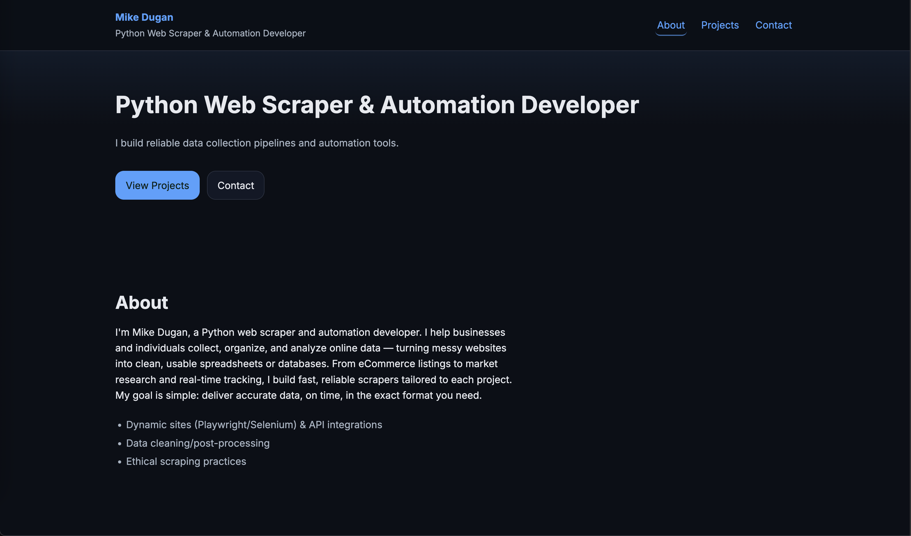

# Mike Dugan – Portfolio Website

A responsive, accessible portfolio website built to showcase web scraping, data, and development projects.  
Designed for freelance clients and recruiters looking for clean, production-ready work.

---

## 🌐 Live Demo

[Visit Portfolio Website](https://mdugan8186.github.io/scraping-portfolio/)

---

## 📖 About

This site highlights my skills in **Python development, web scraping, and automation**, alongside a growing set of professional projects.  
Built from scratch with semantic HTML, responsive CSS, and vanilla JavaScript — optimized for accessibility, dark mode, and smooth client experience.

---

## 🛠️ Tech Stack

- **Frontend:** HTML5, CSS3 (Grid/Flexbox, custom dark mode), Vanilla JavaScript
- **Performance:** Responsive design, lazy-loading images, smooth scrolling
- **Accessibility:** WCAG-compliant color contrast, skip links, ARIA-friendly markup
- **Hosting:** GitHub Pages

---

## 📂 Featured Projects

- **Steam Sale Scraper** – Extracts top discounted games with price, ratings, and categories.
- **OpenGovUS Business Scraper** – Automates business license data collection with validation.
- **BooksToScrape eCommerce Scraper** – Full pipeline scraper with pagination and CSV export.
- **CoinGecko API Scraper** – Collects cryptocurrency market data via public API.

(Full code for these projects is linked directly from the portfolio.)

---

## 🚀 Features

- Fully responsive across desktop, tablet, and mobile
- Dark mode with smooth transitions
- Sticky navigation with auto-highlighting
- Back-to-top button
- SEO-ready (Open Graph, Twitter card metadata, sitemap-ready)

---

## 📬 Contact

For freelance opportunities and collaborations:

- Portfolio: [mdugan8186.github.io/scraping-portfolio](https://mdugan8186.github.io/scraping-portfolio/)
- GitHub: [@mdugan8186](https://github.com/mdugan8186)
- LinkedIn: [ View my profile](https://www.linkedin.com/in/mike-dugan-8aa59b398)
- Fiverr: [ Hire me for web scraping and custom scrapers](https://www.fiverr.com/mdugan8186)
- Upwork: [ Hire me for web scraping and Python automation](https://www.upwork.com/freelancers/~019a69129c6a8c707c?mp_source=share)
- Email: [mdugan8186.work@gmail.com](mailto:mdugan8186.work@gmail.com)

---

## ⚖️ License

This project is open source under the MIT License.
